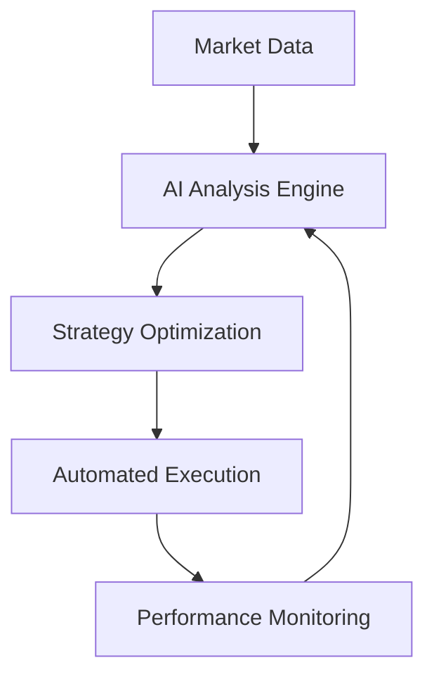

## The easeflow Advantage

In the rapidly evolving blockchain ecosystem, choosing the right infrastructure partner is crucial for success. Here's why easeflow stands out from the competition.

## Unmatched Reliability

<Info>
  **99.9% Uptime SLA**: Our infrastructure is built with enterprise-grade redundancy and monitoring.
</Info>

easeflow's infrastructure is designed for maximum reliability and performance:

**Multi-Region Deployment**:
- Global data centers for optimal latency
- Automatic failover and disaster recovery
- Real-time monitoring and alerting

**Enterprise-Grade Security**:
- Hardware security modules (HSMs)
- Multi-signature authentication
- SOC 2 Type II compliance

## Cost-Effective Solutions

### Transparent Pricing

<CardGroup cols={2}>
  <Card title="No Hidden Fees" icon="receipt">
    What you see is what you pay - no surprise charges or hidden costs
  </Card>
  <Card title="Competitive Rates" icon="chart-bar">
    Best-in-class pricing with volume discounts for enterprise clients
  </Card>
  <Card title="Pay-as-you-Scale" icon="arrows-up-down">
    Flexible pricing that grows with your business needs
  </Card>
  <Card title="Free Tier Available" icon="gift">
    Get started with our generous free tier - no credit card required
  </Card>
</CardGroup>

## Advanced Technology Stack

### AI-Powered Optimization

Our proprietary AI technology sets us apart:



**Key AI Capabilities**:
- Real-time market analysis and prediction
- Automated strategy adjustment
- Risk management and portfolio optimization
- Continuous learning and improvement

### Cutting-Edge Infrastructure

<Accordion title="Node Management">
  Automated node deployment, monitoring, and maintenance with zero-downtime updates and intelligent resource allocation.
</Accordion>

<Accordion title="Staking Optimization">
  Dynamic validator selection, reward optimization, and slashing protection through advanced monitoring systems.
</Accordion>

<Accordion title="Security Architecture">
  Multi-layered security with hardware wallets, cold storage, and continuous security audits by leading firms.
</Accordion>

## Developer-First Approach

### Comprehensive APIs

```bash
# Easy integration with RESTful APIs
curl -X GET "https://api.easeflow.io/v1/nodes" \
  -H "Authorization: Bearer YOUR_API_KEY"
```

### SDK Support

Multiple programming languages supported:
- Python SDK
- JavaScript/TypeScript SDK  
- Go SDK
- Rust SDK

### Documentation & Support

<CardGroup cols={2}>
  <Card title="Interactive Documentation" icon="book-open">
    Comprehensive docs with live examples and testing
  </Card>
  <Card title="Community Support" icon="users">
    Active Discord community with 10,000+ developers
  </Card>
  <Card title="24/7 Technical Support" icon="headset">
    Dedicated support team for enterprise clients
  </Card>
  <Card title="Open Source Tools" icon="code">
    Extensive library of open-source tools and utilities
  </Card>
</CardGroup>

## Proven Track Record

### Trust Metrics

<Note>
  **$500M+ Assets Secured**: Trusted by leading institutions and individual validators worldwide.
</Note>

- **50,000+** Active validators
- **99.95%** Average validator uptime
- **Zero** Security incidents since inception
- **Enterprise clients** across 40+ countries

### Industry Recognition

- **Best Infrastructure Provider** - Blockchain Awards 2024
- **Top Security Rating** - Crypto Security Alliance
- **Innovation Award** - DeFi Summit 2024

## Ready to Get Started?

Join thousands of satisfied customers who chose easeflow for their blockchain infrastructure needs.

<CardGroup cols={1}>
  <Card title="Start Your Free Trial" icon="rocket" href="https://app.easeflow.io/signup">
    Get started with our generous free tier - no credit card required
  </Card>
</CardGroup> 